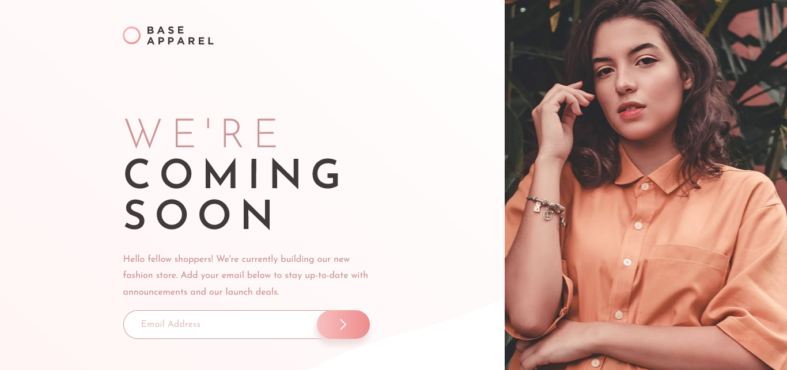

# Frontend Mentor - Base Apparel coming soon page solution

This is a solution to the [Base Apparel coming soon page challenge on Frontend Mentor](https://www.frontendmentor.io/challenges/base-apparel-coming-soon-page-5d46b47f8db8a7063f9331a0).

## Table of contents

- [Overview](#overview)
  - [The challenge](#the-challenge)
  - [Screenshot](#screenshot)
  - [Links](#links)
- [My process](#my-process)
  - [Built with](#built-with)
  - [What I learned](#what-i-learned)
  - [Continued development](#continued-development)
  - [Useful resources](#useful-resources)
- [Author](#author)
- [Acknowledgments](#acknowledgments)

## Overview

### The challenge

Users should be able to:

- View the optimal layout for the site depending on their device's screen size
- See hover states for all interactive elements on the page
- Receive an error message when the `form` is submitted if:
  - The `input` field is empty
  - The email address is not formatted correctly

### Screenshot



### Links

- Live Site URL: [https://lucasepk.github.io/base-apparel-coming-soon/](https://lucasepk.github.io/base-apparel-coming-soon/)

## My process

### Built with

- Semantic HTML5 markup
- CSS
- CSS Grid
- JavaScript

### What I learned

I learnt about onclick and placeholder property. I also learnt input type image and email.

```html
<input type="email" name="email" id="email_input" placeholder="Email Address">

<input type="image" src="images/icon-arrow.svg" id="submit_button" onclick="email_validation(document.getElementById('buttons').email)"> <!--input type "image" is useful to put an image as a submit button without needing to use background image-->
```

In css I learnt to use fractal units with grid, justify and align self, z-index, ch and rem units for text, how to hide html elements, letter spacing, display:block for images, how to remove blue highlight when an input is clicked,
```css
body{
    margin: 0;

    font-family: 'Josefin Sans', sans-serif;
    /*this makes the body a grid with 2 rows and 2 columns*/
    display: grid;
    grid-template-rows: 1fr 4fr;
    grid-template-columns: 2fr 1fr;

    background-image: url(images/bg-pattern-desktop.svg);
    background-size: cover;
}

header{
    width: 450px;/*this makes the image go left, because header is a container for the image, and the image by default goes left*/
    grid-area: 1/1/2/2;
    
    /*This makes the icon align with the text in the middle*/
    justify-self: center;
    align-self: center;
}

main{
    grid-area: 2/1/3/2;

    justify-self: center;
    align-self: center;
}

aside{
    grid-area: 1/2/3/3;
    height: 100vh;
}

aside img{
    height: 100%;
    display: block; /*for some reason this fixes the extra blank space below the image that occurs without it*/
}
```

I learnt to use regex with JavaScript, how to prevent submitting an input if an error happens and how to modify the css in js.
```js
if (email_input.value.match(email_format)){ //this is done when the email is valid
    //alert("Valid email address!");
    return true;
} else { //this is done when the email isn't valid
    //alert("You have entered an invalid email address!");
    event.preventDefault() //this stops the page to reload when submitted
    //this part makes the error message, icon and style changes appear on screen
    document.getElementById('email_input').style.border = "2px solid hsl(0, 93%, 68%)";
    document.getElementById('error_txt').style.display = "block";
    document.getElementById('error_img').style.display = "block";
    return false;
}
```

### Continued development

I would like to continue to expand my css grid knowledge because I find it fun and just better than Flexbox, next time I want to use a css reset and not use IDs as much anymore.

### Useful resources

- [https://youtu.be/EiNiSFIPIQE](https://youtu.be/EiNiSFIPIQE) - Very useful video about CSS grid
- [https://www.freecodecamp.org/news/text-box-in-html-the-input-field-html-tag/](https://www.freecodecamp.org/news/text-box-in-html-the-input-field-html-tag/) - This is where i learnt about the html property of "placeholder"
- [https://www.w3resource.com/javascript/form/email-validation.php](https://www.w3resource.com/javascript/form/email-validation.php) - This is were I learnt about email validation
- [https://www.w3schools.com/js/js_htmldom_elements.asp](https://www.w3schools.com/js/js_htmldom_elements.asp) - Here I learnt how to select an html element by the ID
- [https://www.w3schools.com/js/js_htmldom_css.asp](https://www.w3schools.com/js/js_htmldom_css.asp) - Here I learnt how to change styles of a html element in js
- [https://www.w3schools.com/jsref/event_preventdefault.asp](https://www.w3schools.com/jsref/event_preventdefault.asp) - Here i learnt about `event.preventDefault()`
- [https://fedmentor.dev/posts/font-size-px/](https://fedmentor.dev/posts/font-size-px/) -  Here I learnt what to use instead of pixel units for font size
- [https://meyerweb.com/eric/thoughts/2018/06/28/what-is-the-css-ch-unit/](https://meyerweb.com/eric/thoughts/2018/06/28/what-is-the-css-ch-unit/) -  Here i learnt more about ch units

## Author

- Frontend Mentor - [@LucasEPK](https://www.frontendmentor.io/profile/LucasEPK)

## Acknowledgments

@gracesnow on the Frontend Mentor discord because they helped me a lot in this project
@alexkmarshall on the Frontend Mentor discord
